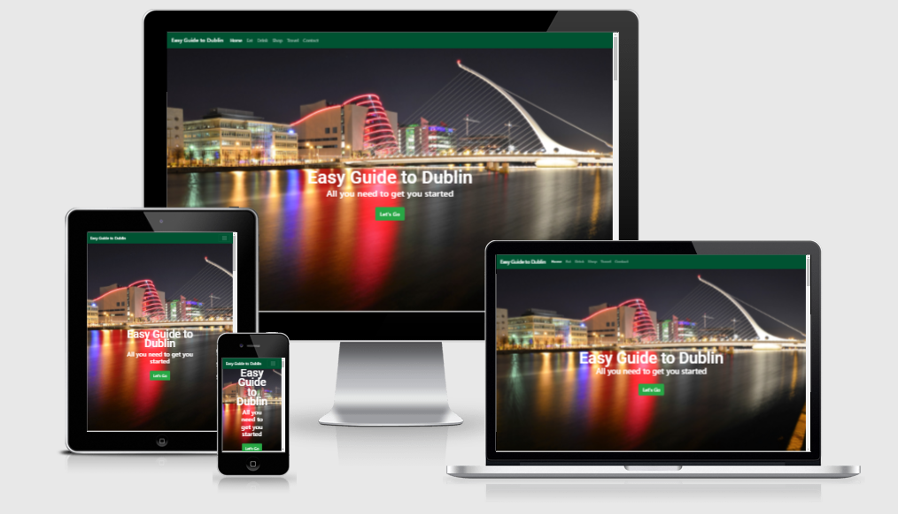
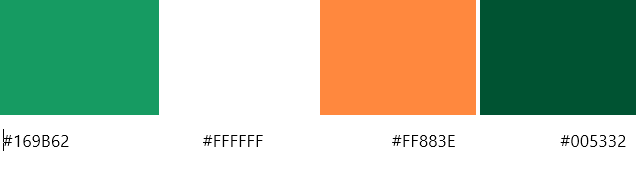
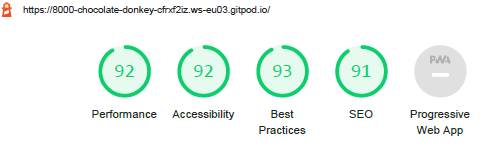
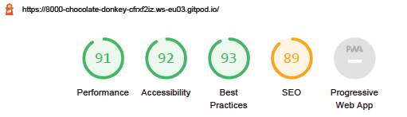

# MS1-Easy-Guide-to-Dublin
**README.md** 

**Easy Guide to Dublin Website**

Project - User-Centric Frontend Development - Code Institute.

**View the live project here (link to be added)**

Dublin has become the destination for many people throughout Europe and the rest of the world, to learn English, embark on further education, find a job or make Ireland their home.

This website is intended to be a simple concise guide to Dublin for those who have settled in the city and is designed to be responsive and available on a variety of devices, making it easy to navigate for regular users and visitors alike.

## User Experience (UX)

**User Stories**

- As a user, I want to easily understand the main purpose of the site 
- As a user, I want to be able to easily navigate throughout the site to find content
- As a user I want to find places to eat 
- As a user I want to find places to drink
- As a user I want to find places to shop
- As a user I want to find out how to get around Dublin
- As a user I want to see social media links to direct me to further information 
- As a user I want to be able to sign up to a Newsletter for more information about things to do in Dublin

### Strategy

**User Needs**

The intention is that the user will access the site primarily on their mobile, tablet and then the desktop. The information is to be presented in a concise manner.

**Technical Aptitudes**

The project will be done using HTML, CSS and Bootstrap 4.6, the framework which is relatively new to me. The idea is to structure the page in a way that the user can navigate it easily and find information quickly.

**Business Vision**

The project is not a commercial venture but simply to inform and educate the user the ease at which Dublin can be enjoyed and navigated, providing a simple guide.  Once users have signed up for the newsletters, there are business opportunities available, such as inviting the purchase of more comprehensive guides, such as eBooks. 

### Scope

The objective is to highlight to new and potential visitors to the city that city is worth visiting and promotes Dublin as a modern vibrant city through imagery and refined look of the site.

### Structure

The original structure was for a multi-page site but this was abandoned as it would not fit the user needs. Instead, a single page site, split into sections with a navigation bar at the top linking to each section, ending with a social media section where users could find more comprehensive information. 

## Design

**Colour Scheme**

The three main colours used on the site are green, white and orange, which represent the colours of the Irish flag. Dublin is the capital of the Republic of Ireland.

The colours are hues rather than the actual colours as I wanted a more refined look to complement the images. I chose a complementary palette with shades of shamrock green and orange.

- Green is used at the beginning on the navigation bar and towards the end to almost &#39;bookend&#39; the site.
- The colour white is used as the foreground text on the &#39;hero image&#39; and the subsequent images on the site.
- Orange is used for the heading on the blocks of text.

- The navigation bar has a colour relating to Shamrock green, and was chosen as it was a less garish introduction than #169B62 , upon testing with the &#39;hero image&#39;.
- Additional colours for the buttons were from Bootstrap and chosen to complement the existing images and colour palette, as well as convey meaning.

**Typography**

- Roboto was chosen as the font for this project as the font family for this website it is currently very popular in modern web design. It has a clean and elegant with a readable shape, which suits the refined style the website is trying to achieve. 

**Icons**

- Icons from the Font Awesome library are used to bring the users attention to additional social media resources.

**Imagery**

- All images were chosen to convey Dublin as a modern city and were meant to be prominent.

**Differences to design**

- The original images that were to be used were collages of images from the developer’s own collection. The images were determined to be dated and in order to have a greater  visual impact the idea of having a ‘hero’ to cover the page with a call to action was implemented.
- In the original design, there were less images and the sections were to be differentiated by background colours of the Irish Flag. 

**Wireframes**

- The wireframes were created using Balsamic, a popular wireframing tool, which Code Institute students can avail of as a fully licenced product.
- This was done during the early stages of the project and demonstrates the structure of the website on different devices including mobile, tablet and desktop.

**Differences to wireframes**

- The first wireframes indicated that the website was designed as multi- page site with up to 6 or 7 pages. 
- This was quickly changed to a single page website to fit in with the idea that this was to be an ‘Easy Guide to Dublin’, hence a single page design was more appropriate. 

[Wireframes](https://github.com/BabusDublinCoding/MS1-Easy-Guide-to-Dublin/tree/master/wireframes)

## Technologies Used

During the development and testing of the website:

- **Languages**

   - HTML: HTML was used to structure the page.

   - CSS: CSS was used to style the different elements on the page.

- **Frameworks and libraries**
  - [Bootstrap 4.6](https://getbootstrap.com/docs/4.6/getting-started/introduction/): Bootstrap library was used to build the layout using the grid system.
  - [Google font](https://fonts.google.com/): Used for the fonts on the website.
  - [Font Awesome](https://fontawesome.com/): Used for the social media icons on the website.

- **Media & wireframes**
  - [Balsamiq](https://balsamiq.com/wireframes/): To design the wireframe.

- **Workspaces & respository hosting**
  - [Gitpod](https://www.gitpod.io/): As a local repository to develop the code.
  - [Visual Studio Code](https://code.visualstudio.com/): As a local repository to develop the code.
  - [Git](https://git-scm.com/): For version control from gitpod to save commits and push code onto GitHub.
  - [GitHub](https://github.com/): To save the code and deploy the live site.
- **Testing**
  - [Chrome DevTools](https://developers.google.com/web/tools/chrome-devtools): Google inspect was used examine and test responsiveness.
  - [Google Mobile Friendly Test](https://search.google.com/test/mobile-friendly?utm_source=gws&utm_medium=onebox&utm_campaign=suit): For additional mobile testing
  - [Google lighthouse](https://developers.google.com/web/tools/lighthouse): Google lighthouse was used to assess performance of the site
  - [W3C HTML Validator](https://validator.w3.org/): To check there's no error in the HTML code.
  - [W3C CSS Validator](https://jigsaw.w3.org/css-validator/): To check there's no error in the CSS code.

## Testing

- Links: Each of the links when clicked have been checked so that the user is directed to the desired location on the page. To enhance the user experience each link has a colour change when hovered.

- Navigation bar: Significant testing was done to ensure links pointed to the correct section of the page resulting in the discovery of a known bug relating to Bootstrap Navbar. When using the fixed top option, it led to part of the text been covered by the navbar, once the link had been clicked. This was solved by pointing to a higher location.

- Social media icons were tested to ensure they worked and included a target attribute so that a new browser tab is opened.

- **Chrome DevTools** was used to test the website on the devices on listed below:

- Moto G4
- Galaxy S5 
- Pixel 2
- Pixel2XL
- iPhone 5/SE
- iPhone 6/7/8 
- iPhone 6/7/8 Plus
- iPhone X 
- iPad 
- iPad Pro 
- Surface Duo 
- Galaxy Fold   

Result was successfully responsive.

**The website was also tested** on the following personal devices

- Lenovo laptop with a 15.6 screen 
- Amazon Fire tablet with a 10.1 screen 
- hp monitor with a 32in screen

`      `Result was successfully responsive.

- Significant testing to ensure the images and colours were in harmony

- Additional testing for responsiveness on all pages was done through Google Mobile Friendly Test

`    `Result was mobile friendly.

- **Google lighthouse** was used to assess the performance of the site 

- mobile receiving scores in the 90s for mobile 

- desktop receiving scores in the 90s for desktop 

- **W3C HTML Validator**

- Just two errors

- **W3C CSS Validator**
- Gave a number warnings relating to &#39;unknown vendor extension&#39; errors. I choose to ignore that warning, as it is to do with the prefixes you are using for different browsers and it is considered best to be using these prefixes than not

## Bugs

- When viewing the website on mobile devices the foreground text on images seemed to ‘crowded’.
- The resolution was to reduce the amount of text, which led to a cleaner look and more concise descriptions.
  Navbar fixed top covering part of the text on the page of the area it pointed to. Resolved by changing the place it pointed to.

- Font awesome icons not showing properly – replaced fab with fa!

- Call to action button not pointing to the right spot. Resolved by adding a few line breaks, a p tag and pointing the id to that. 

- Google Lighthouse report for desktop suggested images were too large. Resolved by replacing the images were lower resolution versions and the performance score went from the 80s to the 90s.  

## Credits

**Code -** adapted from and inspired by the below:

- The full-screen hero image code 

<https://www.w3schools.com/howto/howto_css_hero_image.asp>

- The Bootstrap Library used throughout the project to help in making the site responsive using the Bootstrap Grid System.

<https://getbootstrap.com/docs/4.6/getting-started/introduction/>

- The container code for the sections

<https://www.w3schools.com/bootstrap4/tryit.asp?filename=trybs_default&stacked=h>

- Readme template influenced by Code Institute samples and templates

<https://github.com/Code-Institute-Solutions/readme-template>

- Bootstrap grid and layout explanation

<https://ajgreaves.github.io/bootstrap-grid-demo/index.html>

- Tutorials, Slack posts, webinars, pdfs and YouTube videos by A. J. Greaves 

## Content

- All wording content was written by the developer

## Media

All images sourced as freely-usable images and free stock photos from the websites below:

<https://www.pexels.com>  and <https://unsplash.com>

Home - Photo by [Andrei Carina](https://unsplash.com/@andrei_carina?utm_source=unsplash&utm_medium=referral&utm_content=creditCopyText) on [Unsplash](C:\s\photos\dublin?utm_source=unsplash&utm_medium=referral&utm_content=creditCopyText)

Eat - Photo by [Pablo Merchán Montes](https://unsplash.com/@pablomerchanm?utm_source=unsplash&utm_medium=referral&utm_content=creditCopyText) on [Unsplash](C:\@pablomerchanm?utm_source=unsplash&utm_medium=referral&utm_content=creditCopyText)  

Drink - Photo by [Lucian Potlog](https://www.pexels.com/@lucianphotography?utm_content=attributionCopyText&utm_medium=referral&utm_source=pexels) from [Pexels](https://www.pexels.com/photo/assorted-liquor-bottles-3566226/?utm_content=attributionCopyText&utm_medium=referral&utm_source=pexels)

Shop - Photo by [Tamanna Rumee](https://unsplash.com/@tamanna_rumee?utm_source=unsplash&utm_medium=referral&utm_content=creditCopyText) on [Unsplash](C:\s\photos\shopping?utm_source=unsplash&utm_medium=referral&utm_content=creditCopyText) 

Travel - Photo by [Fabrício Severo](https://unsplash.com/@fssevero?utm_source=unsplash&utm_medium=referral&utm_content=creditCopyText) on [Unsplash](C:\s\photos\dublin-fabr%C3%ADcio-severo?utm_source=unsplash&utm_medium=referral&utm_content=creditCopyText)

## Acknowledgements

- My mentor, Narender Singh, for his searching questions, constructive feedback and his generosity for sharing his knowledge, experience and time.
- The slack community for the treasure trove of knowledge and their willingness to offer advice.
- Tutor support at Code Institute for their support during the latter stages of the project.
- My girlfriend for her support and patience!

